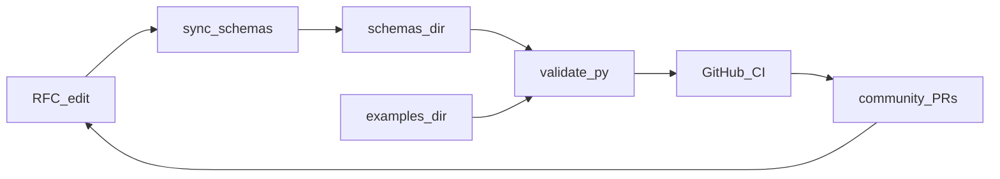

# Roadmap

This document is the **north star** for turning Open CoT from a standards repo into a **chain-of-thought reasoning toolkit**: schemas people can rely on, data they can ship, code they can run, and feedback loops that stay in sync as the community iterates.

For how to contribute day to day, see [contributing.md](contributing.md). For project framing, see [README.md](../README.md). For machine-readable schema index, see [schemas/registry.json](../schemas/registry.json).

---

## Vision and definition of done

**Useful toolkit** here means, in order:

1. **Normative formats** — JSON Schemas (RFC-backed) with clear versioning.
2. **Validation** — One command proves schemas and example instances are consistent.
3. **Reference data** — Small, curated **gold** traces plus a path to **synthetic** data at scale.
4. **Runnable demos** — Mock LLM / tools / verifiers so anyone can test loops without a frontier model.
5. **Minimal benchmarks** — Repeatable tasks and scorers so “better reasoning” is measurable.

It does **not** mean finishing every exploratory RFC or stub schema before the core loop is demonstrably useful. See **Scope tiers** below.

### Conformance and interoperability

To claim Open CoT compatibility, implementations should target explicit conformance profiles:

- **Profile A (Core Trace)**: validates against RFC 0001 reasoning schema and passes core fixture tests.
- **Profile B (Tool + Verifier Sidecars)**: Profile A + RFC 0002 / RFC 0003 sidecar compatibility.
- **Profile C (Packaged Dataset)**: Profile B + RFC 0008 manifest/package checks and split integrity checks.

`v1.0` readiness requires publishing a lightweight conformance suite (fixtures + expected results) with pass/fail criteria.

---

## Scope tiers (manageability)

| Tier | What it covers | Promotion rule |
|------|------------------|----------------|
| **A — Core reasoning loop** | RFC 0001–0008, agent loop ([RFC 0007](../rfcs/0007-agent-loop-protocol.md)), packaging ([RFC 0008](../rfcs/0008-dataset-packaging-standard.md)): trace → validate → optional verifier / tool / reward sidecars → package. | Changes require **RFC text**, regenerated `schemas/`, at least one **`examples/<shortname>/`** fixture, and passing [tools/validate.py](../tools/validate.py) / CI. |
| **B — Patterns and data** | [standards/reasoning-patterns.md](../standards/reasoning-patterns.md), [standards/evaluation-metrics.md](../standards/evaluation-metrics.md), [datasets/](../datasets/README.md) (synthetic, converters, human-annotated). | Align rubrics and converters with Tier A schemas; document dataset manifests beside data. |
| **C — Ecosystem extensions** | RFCs 0009+ (memory, fusion, cost, governance, …); many ship as **stub** schemas until implemented. | Promote toward Tier A only when there is a **vertical slice**: extractable or hand-authored schema, `examples/<shortname>/`, and a stated consumer (tool, benchmark, or doc). |

**Principle:** vertical slices before horizontal sprawl. Prefer one end-to-end path over many half-specified RFCs.

---

## Phased plan

Track progress with checkboxes; dates are optional—adjust as maintainers commit.

### Phase 0 — Spec stability (now → next)

- [ ] Clarify RFC 0001 acceptance criteria in the RFC (what MUST validate, what is extension-only).
- [ ] Treat **registry + examples + CI** as the release gate: every normative schema change ships or updates fixtures under [`examples/`](../examples/) keyed by shortname in [`schemas/registry.json`](../schemas/registry.json).
- [ ] Keep the pipeline authoritative: edit [`rfcs/`](../rfcs/) → [`tools/sync_schemas_from_rfcs.py`](../tools/sync_schemas_from_rfcs.py) → commit `schemas/` → [`tools/validate.py`](../tools/validate.py) → [validate-schemas workflow](../.github/workflows/validate-schemas.yml).
- [ ] Define and publish conformance profiles (A/B/C above) and a minimal conformance fixture set in `examples/` + CI checks.

### Phase 1 — Gold samples and synthetic v0

- [ ] **Task bank**: small curated set (math, code, planning) as JSONL under `datasets/synthetic/` with a README manifest (sources, license, schema version).
- [ ] **One converter**: e.g. minimal GSM8K-style (question / answer / optional rationale) → [`schemas/rfc-0001-reasoning.json`](../schemas/rfc-0001-reasoning.json) in `datasets/converters/`.
- [ ] **Expand `examples/`** for Tier A shortnames still thin today: `tool_invocation`, `branching`, `reward`, `ensemble` (and packaging sidecars as needed).
- [ ] Add **dataset safety gates** for release candidates: PII scan pass, license/provenance declaration, and unsafe-content review checklist documented in dataset manifests.

Validated JSON fixtures live only under **`examples/<registry-shortname>/`** (not under `standards/`). Narrative pattern docs stay under [`standards/`](../standards/).

### Phase 2 — Mock harness and tests (“showcase code”)

- [ ] **Deterministic harness** in [`reference/python/`](../reference/python/) (or a future `playground/`): mock **LLM** (fixed step stream), **tool** (recorded I/O), **verifier** (rule-based or fixture), aligned with [`schemas/rfc-0007-agent-loop.json`](../schemas/rfc-0007-agent-loop.json) and Tier A traces.
- [ ] **pytest** (follow-up): validate all `examples/**/*.json`, run harness on canned transcripts; optional extra CI job once tests exist.

Goal: newcomers can **mock, test, validate, and experiment** without API keys or GPUs.

### Phase 3 — Benchmark slice

- [ ] **`benchmarks/tasks/`**: small task spec format (JSON or YAML): prompt, reference answer, optional step rubric.
- [ ] **`benchmarks/scoring/`**: step-level and final-answer checks; tie metrics to [standards/evaluation-metrics.md](../standards/evaluation-metrics.md).
- [ ] **`benchmarks/leaderboards/`**: one documented stub (columns, how to submit runs)—not a live service required for v0.
- [ ] Add benchmark governance: fixed split policy, hidden test holdout policy, run card template (model, seed, decoding config), and anti-gaming rules.

### Phase 4 — Community feedback loop

- [ ] **RFC lifecycle labels** (in repo policy): *Draft* → *Implementation-required* (schema + `examples/` path) → *Stable* for Tier A.
- [ ] **RFC companion PRs**: prose RFC + generated schema + examples in one reviewable unit where possible.
- [ ] **Registry semver**: bump [`schemas/registry.json`](../schemas/registry.json) `version` when the schema set meaningfully changes; note in a changelog (add `CHANGELOG.md` when ready).
- [ ] **Optional**: issue/PR templates describing affected tier, affected shortnames, and whether `tools/diff_checker.py` / [schema-breaking-changes workflow](../.github/workflows/schema-breaking-changes.yml) applies.
- [ ] Add lifecycle policy for stale RFCs: *Superseded* / *Archived* labels with deprecation notes and replacement links.

**Time-box suggestion:** cap how many Tier C RFCs move to *Implementation-required* per quarter unless each ships schema + example + consumer.

### Phase 5 — Small model prove-out (required for v1.0 usability)

- [ ] **`experiments/`** (new, lightweight): README + one script or notebook recipe: tiny open LM or small API model, SFT or distillation on Tier A synthetic slice.
- [ ] **Success criteria** (document, not leaderboard hype): e.g. high **schema-valid** rate on held-out prompts from the task bank + simple task accuracy; publish configs and data hash for reproducibility.
- [ ] Require one reproducible reference run (config + outputs + validation report) before declaring v1.0 "usable toolkit."

Training stacks stay **out of the core tree** until the project explicitly wants them—avoid bloating the reference repo before Phase 0–2 are healthy.

---

## What is missing today

Honest gaps relative to the vision above:

- No **synthetic generators** or versioned JSONL task bank under `datasets/synthetic/`.
- No **converters** from external formats under `datasets/converters/`.
- No **pytest** (or other) automated test suite for harness + examples—only [tools/validate.py](../tools/validate.py).
- **`benchmarks/`** is still placeholders (`.gitkeep` only).
- **`reference/python/`** is minimal (parse / validate / generate stubs)—no mock agent loop.
- Many **Tier C** RFCs rely on **stub** schemas; that is intentional until slices land—see tiers.
- No explicit conformance suite/profiles yet (hard to assert interoperability claims).
- No documented dataset safety/privacy release gate for reasoning traces.
- No benchmark anti-gaming / run-card policy yet.

There is not yet a single **quickstart** narrative tying README → `tools/validate.py` → `examples/`; improving README “Getting started” is a natural follow-up after Phase 1–2 land.

---

## Project management principles

1. **One artifact, one owner path** — RFC markdown ↔ [`tools/sync_schemas_from_rfcs.py`](../tools/sync_schemas_from_rfcs.py) ↔ `schemas/rfc-*.json` ↔ `examples/<shortname>/` ↔ CI ([validate-schemas.yml](../.github/workflows/validate-schemas.yml)).
2. **Done means validated + example** — For Tier A, merging without an example fixture should be exceptional (document why if so).
3. **Breaking changes are explicit** — Schema tightening runs through [tools/diff_checker.py](../tools/diff_checker.py) on PRs touching `schemas/` ([schema-breaking-changes.yml](../.github/workflows/schema-breaking-changes.yml)); migration notes live in the RFC or changelog.
4. **Pre-commit optional, CI mandatory** — [`.pre-commit-config.yaml`](../.pre-commit-config.yaml) mirrors CI locally; contributors without pre-commit still get validation on push.
5. **Interoperability is tested, not implied** — conformance profiles and fixture suites are required to make compatibility claims.
6. **Openness includes safety** — data transparency must ship with provenance, licensing, and privacy checks.

---

## Related docs

- [Philosophy](philosophy.md) — why open reasoning traces matter.
- [Contributing](contributing.md) — hooks, sync, and PR expectations.
- [Datasets README](../datasets/README.md) — layout for synthetic and converters.
